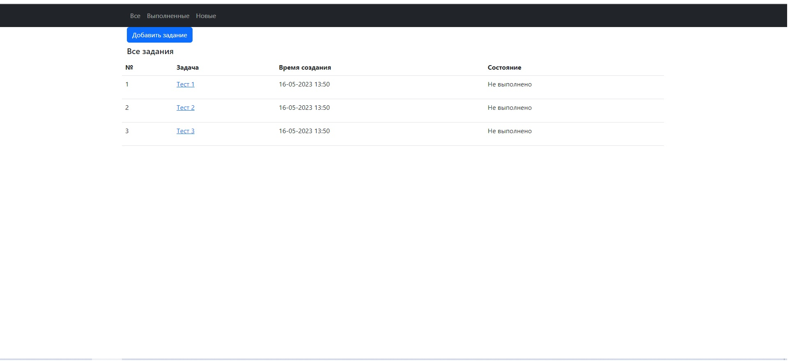
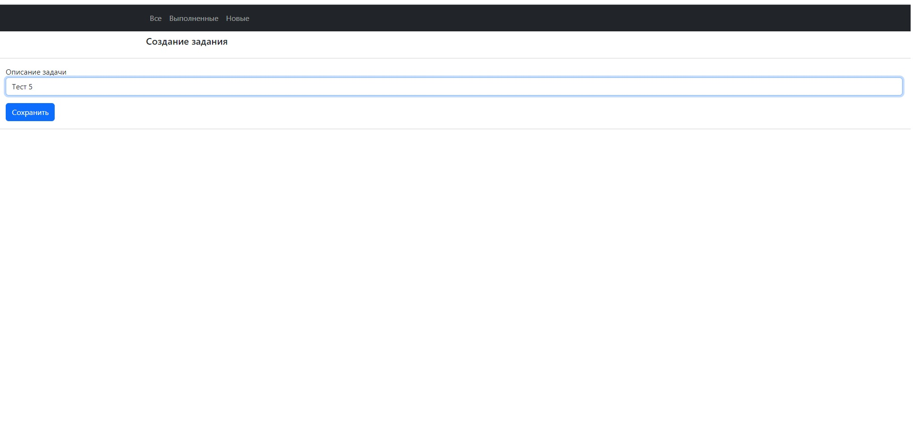
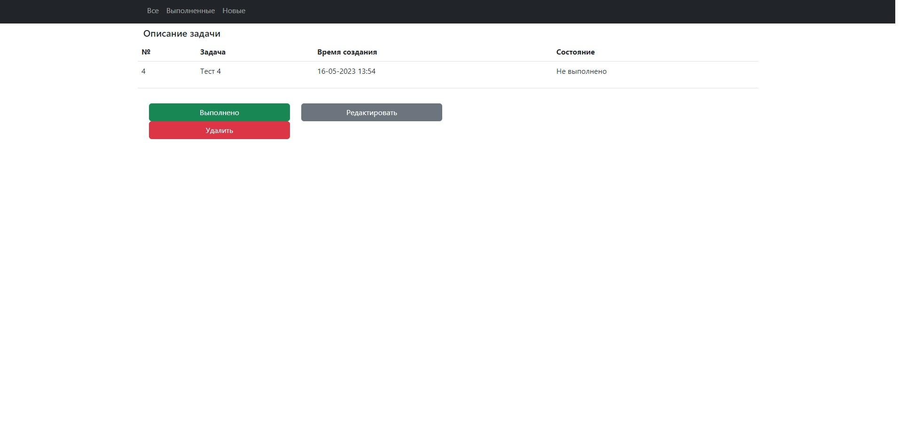
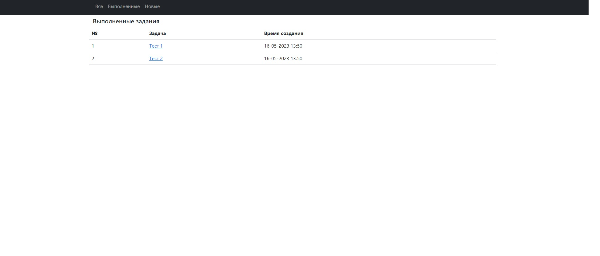
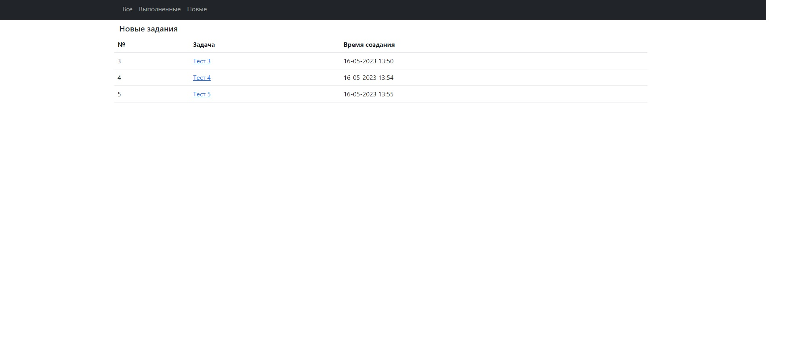

### Название проекта: 
***job4j_todo***;
___
### Описание проекта:
проект представляет из себя приложение "TODO список", реализованы функции создания и сохранения списка задач, выведения его на экран, просмотр отдельных задач, их редактирование, отметка об исполнении и удаление;
___
### Стек технологий: 
+ Spring Boot 5, 
+ Thymeleaf 3.0, 
+ Bootstrap 5, 
+ Liquibase 4.15.0, 
+ PostgreSQL 14;
___
### Требования к окружению: 
+ Java 17, 
+ Maven 3.8, 
+ PostgreSQL 14;
___
### Взаимодействие с приложением:
***Основные виды приложения:***
+ *Страгица со списком всех задач*
  
+ *Страница добавления задачи*
  
+ *Страница просмотра задачи*
  
+ *Страница с выполненными задачами*
  
+ *Страница с невыполненными задачами*
  
### Запуск проекта: 
+ Создать базу данных командой ```create database todo```;
+ Запустить проект командой ```mvn spring-boot:run```;
___
### Контакты: 
Телеграм: @semi999rus